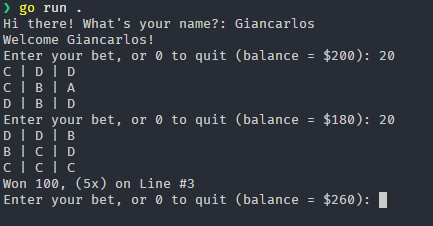

# Gambling Tech with Tim

Built by following along with Tim's video on YouTube: https://www.youtube.com/watch?v=0ySoir3qBuM

Preview:

## Features
- Spin the slot machine
- Check for winning lines
- Calculate the winnings
- Update the balance

## How to run
1. Clone the repository
2. Run `go run .`

## Disclaimer

A command-line gambling simulation built with Go for educational purposes only. This project is designed to demonstrate CLI development, Go programming concepts. I do not endorse or support gambling activities - this is strictly a learning exercise to explore programming techniques and game logic implementation.